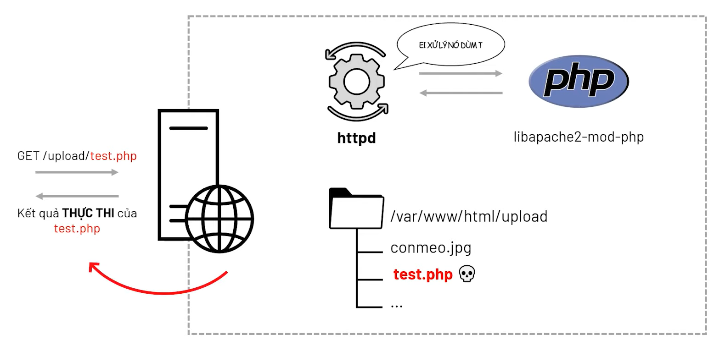

# I. Khái quát

## 1. Cơ chế nhận file của PHP


## 2. Apache xử lí một file `.php` như thế nào ?
Khi có một request đến file có đuôi là `index.php`. Thì một mình `Httpd Apache` không thể xử lí được các yêu cầu mà liên quan tới file `php`. Do vậy khi setup thì ta phải install một môđun có tên là `liapache2-mod-php`.


`mod-php` chúng ta có thể hiểu đơn giản : nó chính là cầu nối giữa `Apache` và `PHP` , giúp cho `Apache` tận dụng được các chương trình php để mà thực thi đoạn code php


## 3. PHP Upload File Vulnerable

Chúng ta đều đã quen thuộc với các tính năng thay đổi ảnh đại diện, ảnh bìa trong quá trình hoàn thành hồ sơ cá nhân. Quá trình tải lên một ảnh đại diện chính là đang thực hiện hành động upload file, cụ thể tệp tải lên ở đây là tệp tin dạng hình ảnh.

Nếu thay vì upload một file avatar, kẻ tấn công có thể tải lên một tệp có phần mở rộng `.php`. Sau đó truy cập đường dẫn thư mục chứa tệp đã tải lên khiến hệ thống thực thi các lệnh trong tệp này.

Như đã tìm hiểu cách Apache xử lí một file `.php` ở **phần 2** thì giả xử một file `test.php` có chứa bất kì những mã tấn công nào do người dùng upload lên, mà HTTPd lại đi thực thi một đoạn code do người dùng upload lên => Server đã bị tấn công thành công!!!




!! OMG , Tiếp theo chúng ta sẽ đi đến cách khai thác lỗ hổng và một số kĩ thuật tấn công.

# II. Khai thác lổ hổng

## 1. Thực thi mã từ xa thông qua việc tải lên web shell

Tận dụng việc upload file để triển khai web shell, là một lỗ hổng bảo mật nghiêm trọng. 

Khi một trang web cho phép người dùng tải lên các tệp, nhưng không có kiểm tra và hạn chế đúng đắn, kẻ tấn công có thể tận dụng điều này để tải lên một tệp chứa mã độc hại, thường là một đoạn mã web shell.

Đầu tiên, hãy hiểu rõ về khái niệm web shell.

**Web Shell là gì?**
Web shell là một đoạn mã độc hại, cho phép kẻ tấn công thực hiện các lệnh tùy ý trên máy chủ web từ xa chỉ bằng cách gửi các HTTP requests đến một điểm cuối (endpoint) cụ thể trên máy chủ.

**Tác động của việc triển khai web shell:**
Nếu kẻ tấn công thành công tải lên một web shell, họ có thể kiểm soát hoàn toàn máy chủ. Điều này có nghĩa là họ có thể đọc và ghi vào bất kỳ tệp nào, đánh cắp dữ liệu nhạy cảm, thậm chí sử dụng máy chủ để thực hiện các cuộc tấn công chuyển hướng đối với cả cơ sở hạ tầng nội bộ và các máy chủ khác bên ngoài mạng.

**Ví dụ cụ thể về Web Shell:**
1. **Đọc Tệp Tùy Ý:**
    - Khi web shell được triển khai, bạn có thể sử dụng một đoạn mã PHP như sau để đọc nội dung của bất kỳ tệp nào trên hệ thống máy chủ:
        ```php
        <?php echo file_get_contents('/đường/dẫn/đến/tệp/target'); ?>
        ```
    - Sau khi tải lên, việc gửi một yêu cầu cho tệp độc hại này sẽ trả về nội dung của tệp mục tiêu trong phần Respone.

2. **Web Shell Linh Hoạt Hơn:**
    - Một web shell linh hoạt hơn có thể có dạng như sau:
        ```php
        <?php echo system($_GET['command']); ?>
        ```
    - Script này cho phép bạn truyền một lệnh hệ thống (tùy ý) thông qua một tham số truy vấn như sau:
        ```
        GET /example/exploit.php?command=id HTTP/1.1
        ```

Việc này mở ra khả năng thực hiện mọi lệnh tùy ý trên máy chủ từ xa chỉ bằng cách thay đổi tham số truy vấn. Điều này đặt ra một mối đe dọa nghiêm trọng về an ninh, vì kẻ tấn công có thể thực hiện các hành động độc hại mà không cần trực tiếp truy cập vào máy chủ.

## 2. Content/type Vertification

Đây là kiểu xác thực mà nhà phát triển yêu cầu file upload trong trường hợp này bắt buộc phải là kiểu image thì mới được chấp thuận . Tuy nhiên , Content/type lại có thể thay đổi trước khi đến server cho nên chúng ta chỉ cần đổi từ `type application/octet-stream` sang image/(kiểu định dang ảnh của bạn) ví dụ như là `image/jpeg` hoặc `image/png`


## 3. The extensions Black listing

Như cái tên gọi của nó, black list tức là 1 danh sách đen các shell bị các nhà phát triển web chặn nhằm chống việc tải shell lên trang web. Tuy nhiên, không thể lọc hết tất cả các loại shell, và có một số cách để vượt qua giới hạn này.

1. **Thay Đổi Đuôi Extension:**

   Hacker có thể thay đổi đuôi extension của shell để tránh bị chặn. Chẳng hạn, nếu nhà phát triển chỉ chặn các tệp PHP (ví dụ: .php), hacker có thể sử dụng các đuôi như .php1, .php2, .php3, .php4, .php5, .php6, .php7, .phps, .pht, .phtm, .phtml, .pgif, .shtml, .phar, .inc, .htaccess để vượt qua.

2. **Chồng Extension và Phân Biệt Chữ Hoa/Chữ Thường:**

   Nếu tất cả các đuôi đã được thử nghiệm nằm trong danh sách đen, hacker có thể thử chồng extension và thay đổi chữ hoa/chữ thường, ví dụ: shell.Php1, shell.PHP2.

3. **Sử Dụng Regular Expression (Regex):**

   Nhà phát triển có thể tạo một regex kiểm thử .jpg. Hacker có thể thử cách chồng extension như là shell.jpg.php để vượt qua giới hạn regex.

4. **Sử Dụng Tệp `.htaccess`:**

   Nếu tất cả các phương pháp trên đều thất bại, hacker có thể tận dụng tệp `.htaccess`. Tệp `.htaccess` là một tệp cấu hình cho thư mục hiện tại, thường được sử dụng để điều chỉnh cấu hình của máy chủ web Apache. Hacker có thể thêm extension và đặt nó để thực thi theo loại tệp mà họ muốn. 
   Ví dụ: `AddType application/x-httpd-php .jpg` trong tệp `.htaccess` cho phép tệp hình ảnh (jpg) chạy mã PHP.


## 4. The extentions White listing

Trái ngược với black list , có một số trang web lại yêu cầu bạn bắt buộc phải sử dụng những extension được liệt kê trong white list như là.jpg ,jpeg , .gif ,... Vậy làm như thế nào để vượt qua được nó :

- **Null Byte Injection** là một kỹ thuật khai thác trong đó sử dụng các ký tự null byte URL-encoded (ví dụ: 00%, hoặc 0x00 trong hex) được người dùng cung cấp. Một null byte trong các URL được đại diện bởi ‘00%’, trong ASCII là một ” ” (giá trị null ) trong quá trình lây nhiểm . Phần sau %00 sẽ được hiểu là giá trị null , là giá trị kết thúc của chuỗi nên tệp được tải lên với tên là shell.php
  >`shell.php%00.jpg`

- **Bypass using Double Extension** :
    >Trong một số trường hợp , chúng ta có thể sử dụng `shell.php.jpg`,`shell.php;.jpg`,`shell.php:jpg` để thực thi lệnh shell , nhưng lổ hỗng này, thường là do cấu hình của webserver hoặc hệ điều hành . Lỗi của nhà phát triển ở đây , là khi chúng ta tải tệp tin lên mà tên của tệp tin không thay đổi dẫn đến lỗ hổng này

- **Invalid Extension Bypass** : 
  >Ngoài ra , vẫn còn 1 số lỗi từ phía máy chủ như là nếu chúng ta sử dụng extension .test thì hệ điều hành sẽ không nhận ra . Cho nên chúng ta có thể tải lên tệp shell.php.test và hệ điều hành sẽ bỏ qua .test và thực thi shell


## 5. Bypassing the Content Length and Malicious Script Checks 
Bypassing the Content Length and Malicious Script Checkscó thể là một phương thức không phổ biến, thường áp dụng cho một số trang web cụ thể. Trong một số trường hợp, trang web có thể thực hiện kiểm tra độ dài của tệp được tải lên và kiểm tra nội dung của tệp để đảm bảo rằng nó không chứa mã độc hại. Dưới đây là cách chúng ta có thể thực hiện bypass, thường được sử dụng khi kiểm tra độ dài:

```php
<?php system($_GET[0]); ?>
```

Trong đoạn mã trên, chúng ta sử dụng hàm `system` của PHP để thực thi một lệnh được truyền qua tham số `$_GET[0]`. Điều này có thể được sử dụng như một cách để truyền mã lệnh từ yêu cầu HTTP, thông qua tham số trong URL. 

Ví dụ, nếu URL trông như sau:

```
http://example.com/upload.php?0=ls
```

Thì đoạn mã PHP trên sẽ thực hiện lệnh `ls`, và kết quả sẽ được hiển thị trong kết quả của trang web.

