## Level 1
Đầu tiên ta được cung cấp cho giao diện như sau
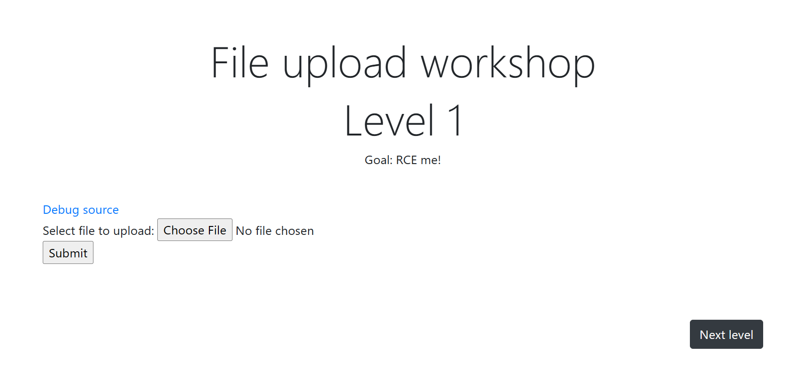

Bấm vào `Debug source` sẽ hiện ra source code của thử thách

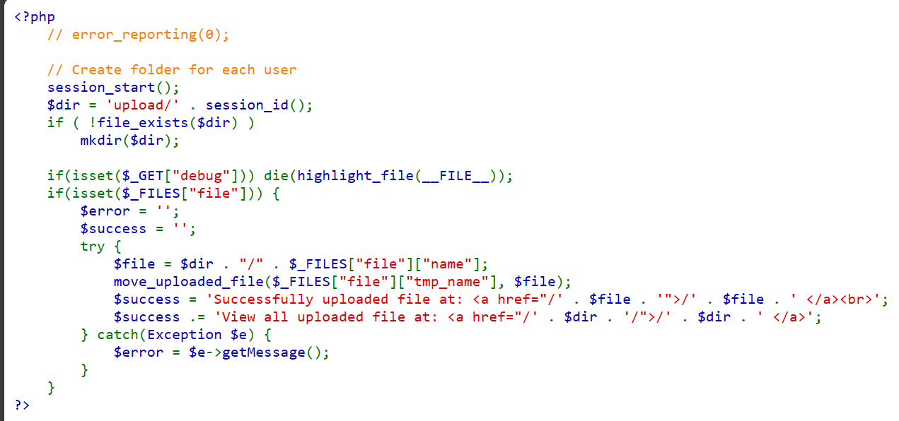

Đại khái là khi ta upload một file thì file sẽ lưu ở thư mục `upload/session_id/file_name`

Vì file được upload mà không được filter , nên ta sẽ upload một file php để tìm flag

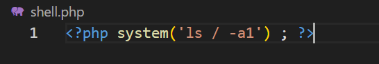

Trong PHP, hàm system() được sử dụng để thực hiện một lệnh hệ thống.

Trong ví dụ này, ls -al là một lệnh Unix/Linux để liệt kê tất cả các tệp và thư mục (bao gồm cả các tệp và thư mục ẩn) 

Upload file thành công

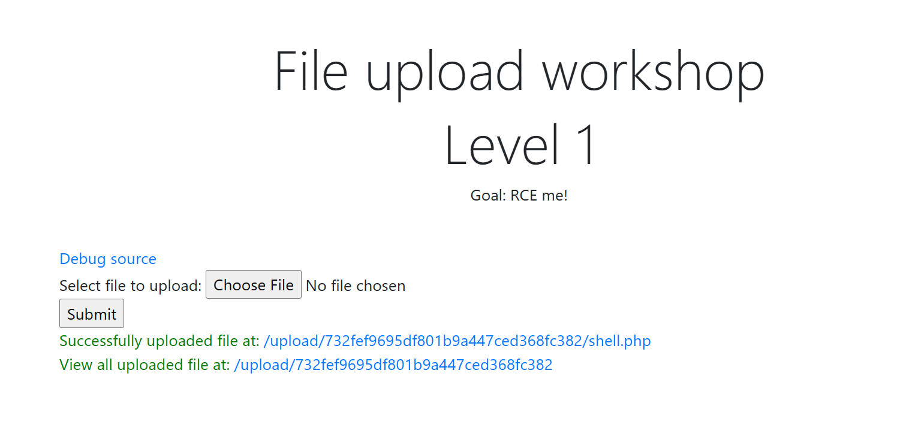

Nhấn vào file vừa được upload , ta thấy flag nằm ở file `secret.txt `

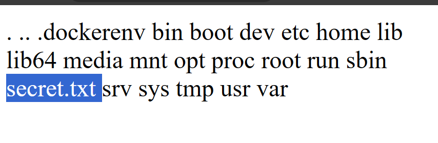

Lúc này ta sửa câu lệnh thành `cat /secret.txt` để lấy flag

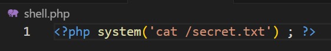

Thực hiện tương tự như các bước trên ta tìm được flag

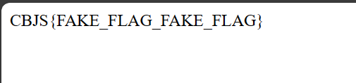

Flag : CBJS{FAKE_FLAG_FAKE_FLAG}

## Level 2
Đầu tiên ta được cung cấp giao diện như sau : 
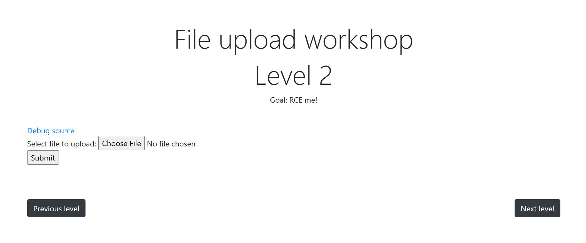

Tương tự như level 1 , ta thử check source code 

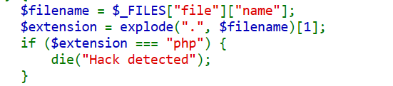

Lần này file đã được filter bằng hàm explode
Hàm này sẽ tách các phần tử trước và sau dấu `.`
Ví dụ ta upload 1 file có tên là `shell.php` thì :
arr[0] = shell
arr[1] = php

Hàm luôn luôn lấy phần tử ở vị trí thứ 1 , cho nên ta có thể bypass bằng cách đặt tên như sau : `shell.haha.php`

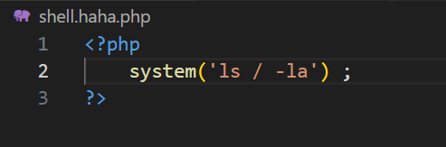

Ta đã RCE thành công  

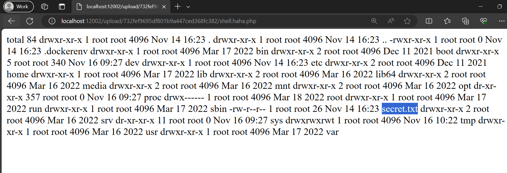

Lụm flag

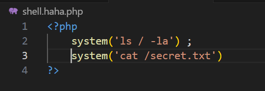

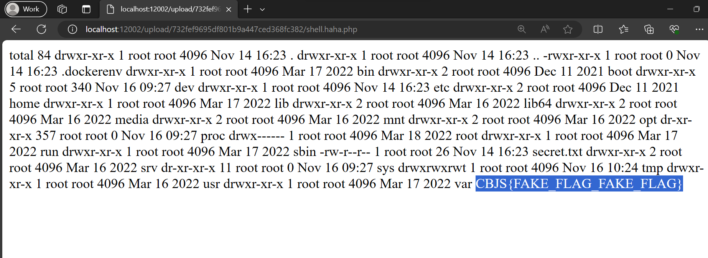

Flag : CBJS{FAKE_FLAG_FAKE_FLAG}

## Level 3 
Đầu tiên ta được cung cấp giao diện như sau : 
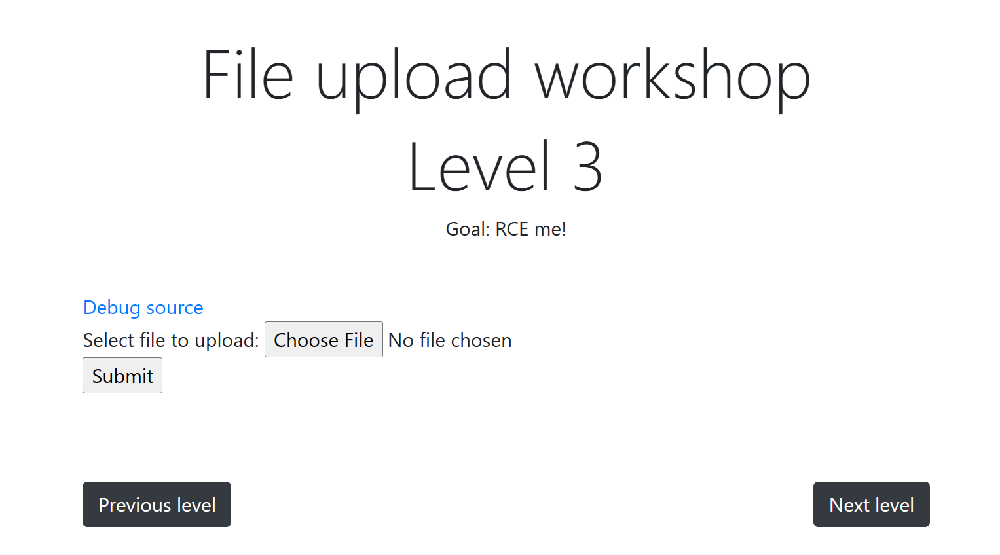

Check thử source code thì thấy rằng lần này file đã được filter kĩ hơn level 2 bằng cách luôn luôn lấy vị trí cuối cùng : 

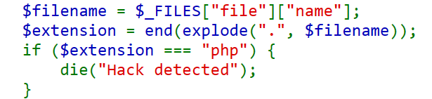

Do vậy ta sẽ sử dụng các đuôi extension khác để chạy php 
>**Thay Đổi Đuôi Extension:**
   Thay đổi đuôi extension của shell để tránh bị chặn. Có thể sử dụng các đuôi như .php1, .php2, .php3, .php4, .php5, .php6, .php7, .phps, .pht, .phtm, .phtml, .pgif, .shtml, .phar, .inc để vượt qua.

Mình đã thử tới đuôi `.phtml` thì đã RCE thành công 

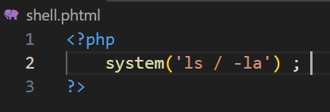

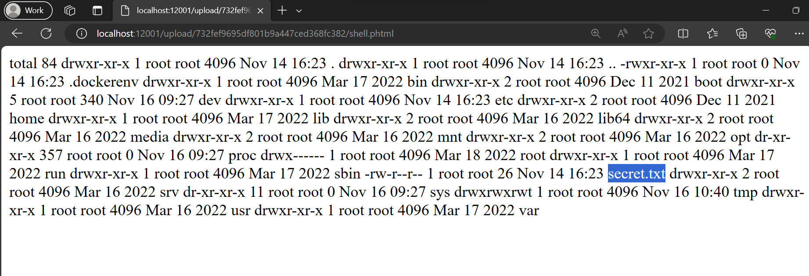

Lụm flag thôi 

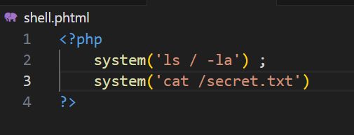

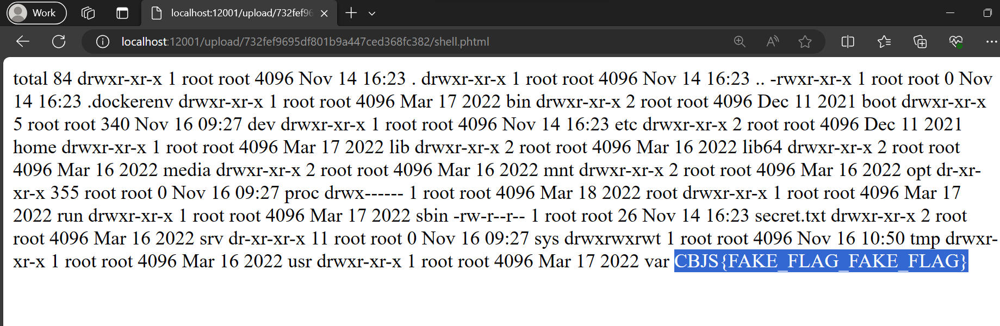

Flag  : CBJS{FAKE_FLAG_FAKE_FLAG}

## Level 4
Đầu tiên ta được cung cấp giao diện như sau :
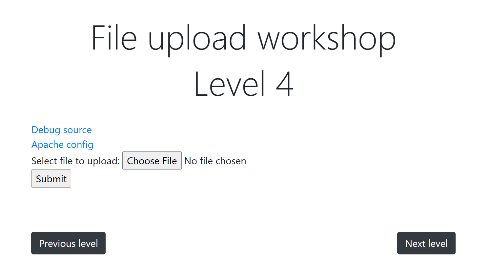

Khác với level trước , lần này ta có thể xem được config của Apache.

Ta sẽ xem source trước coi thử có thay đổi gì hay không 

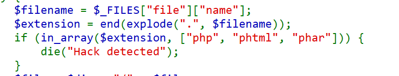

Lần này cũng tương tự như level 3 nhưng khác biệt là sẽ kiểm tra tiếp coi nếu thuộc 3 extension `.php` , `.phtml` , `phar` thì sẽ hiển thị thông báo `Hack detected`

Ta sẽ tiếp tục coi thử config của Apache , bởi vì đề bài lần này cho ta coi hẳn config nên chắc sẽ có gợi ý gì đó.

Trong config này có một phần khá đặc biệt  

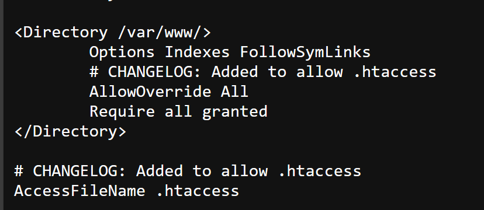

Config apache này cho phép chúng ta upload file `.htaccess` và ghi đè lên những file `.htaccess` khác.

Ở trong phần lý thuyết ta đã phân tích thì để thực thi được các file `.php` mỗi khi có request tới thì apache phải sử dụng module `libapache2-mod-php`.

Để lấy ra module `libapache2-mod-php` và bảo nó thực thi file có đuôi `.php` thì tại file `apache2.conf` nằm ở đường dẫn `/etc/apache2/apache2.conf` thường sẽ có 2 dòng sau:

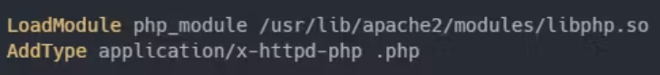
- LoadModule cho phép thêm module libapache2-mod-php
- AddType cho phép các file có đuôi `.php` ánh xạ với 1 loại MIMETYPE. MIMETYPE này chính là `application/x-httpd-php`.

Còn về file `.htaccess` là một file cấu hình cho thư mục hiện tại.
Ta còn có thể add thêm extension và cho nó thực thi theo loại file mà ta muốn. Ví dụ nếu ta ghi vào `.htaccess`: `AddType application/x-httpd-php .nightcore
`
Lúc này tất cả các file có đuôi là nightcore sẽ được execute dưới dạng file php

**Vậy ta có được 1 cách bypass, đó chính là sử dụng `.htaccess` để ghi đè cấu hình AddType của apache.**

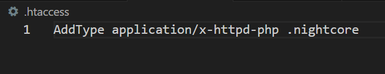

Ta sẽ tiếp hành up file `.htaccess` này lên 

Sau đó thử upload `shell.nigtcore` để RCE

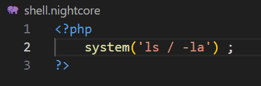

Vậy ta đã RCE thành công 

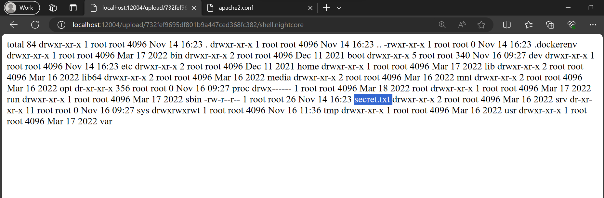

Cuối cùng là lấy flag 

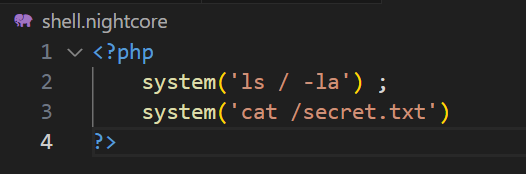

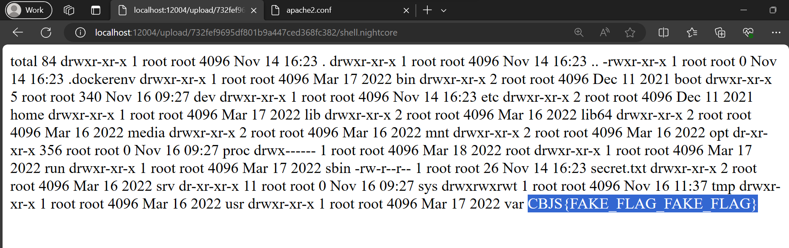

Flag : CBJS{FAKE_FLAG_FAKE_FLAG}

## Level 5
Đầu tiên ta được cung cấp giao diện như sau :
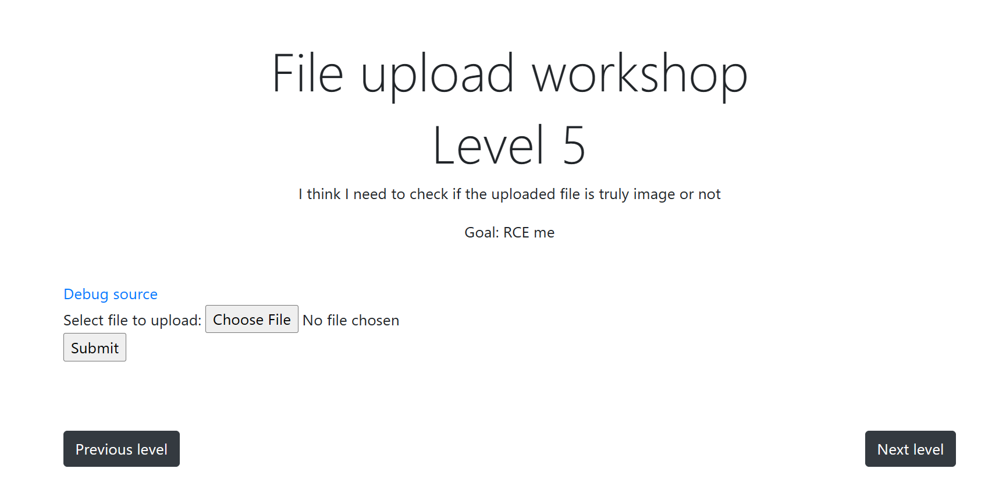

OK ta sẽ check thử source code để xem có gì khác với level trước 

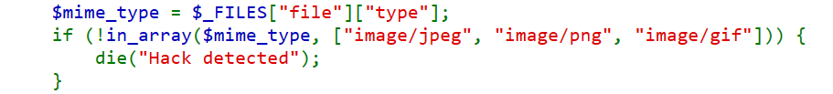

Lần này đề bài kiểm tra type của file upload .

Ta có thể bypass bằng cách thay đổi header `Content-Type` bằng Burp Suit trước khi gửi lên server

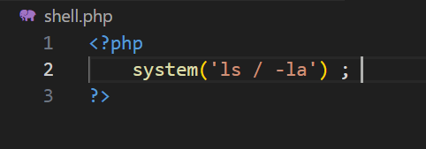

Dùng Burp Suit để bắt

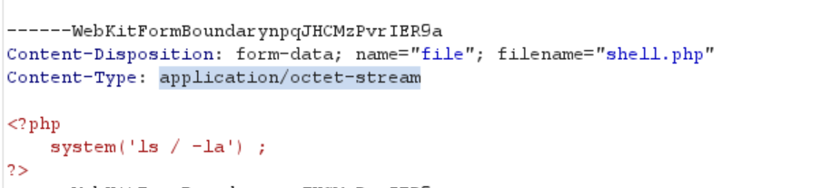

Và sửa thành 

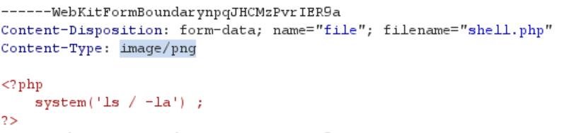

Vậy ta đã RCE thành công :

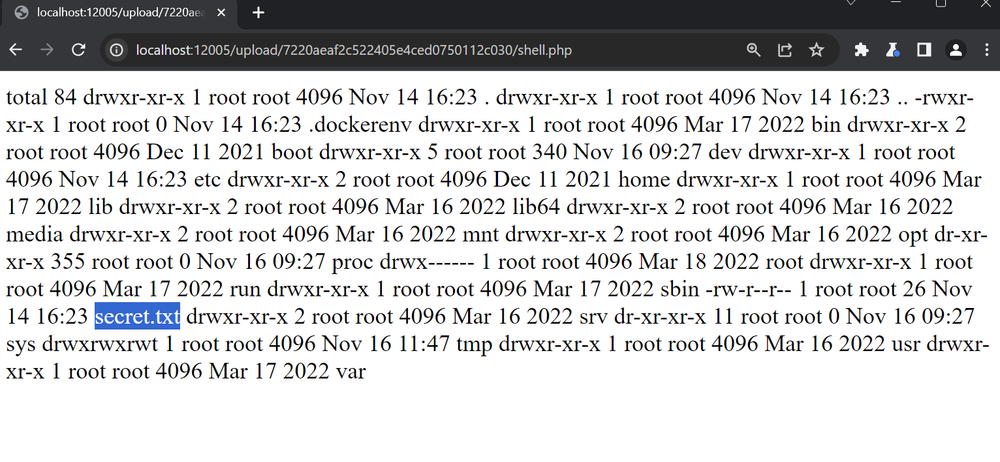

Cuối cùng lấy flag : 

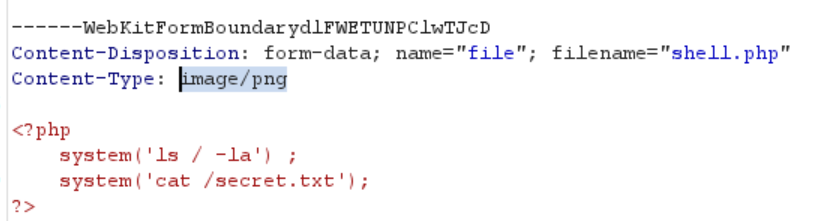

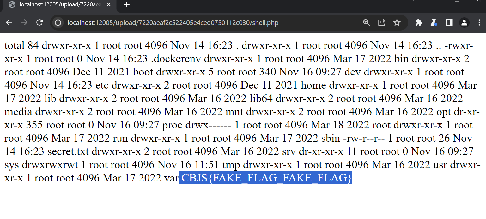

Flag : CBJS{FAKE_FLAG_FAKE_FLAG}

## Level 6
Đầu tiên ta được cung cấp giao diện như sau :

Ta check thử source code 

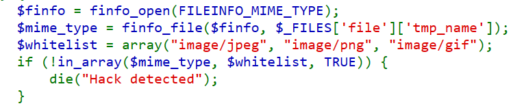

Dòng 1, hàm finfo_open() với tham số FILEINFO_MIME_TYPE để lấy ra magic_database.
- Magic database là một loại cơ sở dữ liệu chứa thông tin về các loại tệp tin dựa trên nội dung của chúng thay vì dựa vào phần đuôi extension.

- Magic database thường chứa các mẫu (patterns) hoặc chữ ký (signatures) đặc biệt, được thiết kế để nhận diện các đặc điểm duy nhất trong dữ liệu của tệp tin. Các hệ thống thường sử dụng một thư viện hoặc công cụ kiểm tra tệp tin để so sánh dữ liệu của tệp với các mẫu trong magic database và xác định định dạng tệp tin .

Điều này hữu ích trong nhiều trường hợp, đặc biệt là khi phần mở rộng tên tệp không phản ánh đúng định dạng thực sự của tệp tin. Magic database thường được sử dụng trong các hệ thống quản lý tệp, trình quét virus, các ứng dụng đọc tệp tin, và các công cụ khác liên quan đến xử lý và xác định định dạng của tệp tin.

>MIME hay Multi-purpose Internet Mail Extensions. MIMETYPE tạo thành một tiêu chuẩn để phân loại các loại tệp trên Internet. Các chương trình Internet như máy chủ Web và trình duyệt đều có danh sách các MIMETYPE để chúng có thể chuyển các tệp cùng loại theo cùng một cách, bất kể chúng đang làm việc trong hệ điều hành nào.

Dòng 2, hàm finfo_file() được dùng để kiểm tra MIMETYPE của file vừa được upload. Việc kiểm tra này được thực hiện bằng cách so sánh file signature (hay còn gọi là chữ ký đầu tệp của file vừa được upload với file signature nằm trong magic_database)
>Hàm finfo_file sẽ xác định MIME type từ `file signature` của file được upload và gán vào $mime_type

Dòng 3 và 4, ta thấy chỉ có 3 dạng MIMETYPE được chấp nhận là "image/jpeg", "image/png", "image/gif".

Hàm finfo_file() chỉ check MIMETYPE bằng các ký tự đầu tệp, cho nên các ký tự phía sau sẽ không được check. Từ đó ta có thể thêm code của mình đằng sau để bypass cơ chế check này.

Mình sẽ dùng `file signature` của file `GIF` để chèn vào đầu file.

Tham khảo các `file signature` tại đây : https://en.wikipedia.org/wiki/List_of_file_signatures

Ok test thôi

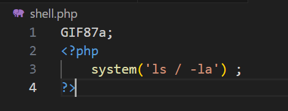

Ta đã gửi thành công 

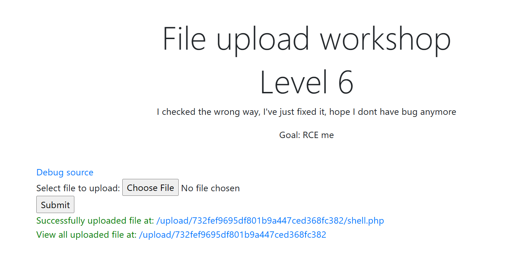

Đã RCE thành công :

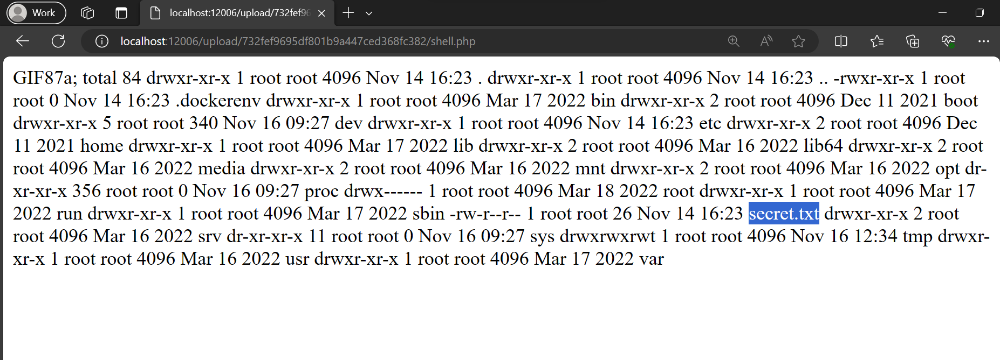

Lụm Flag :

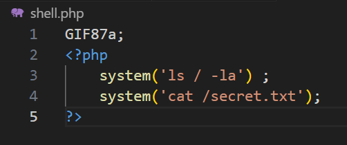

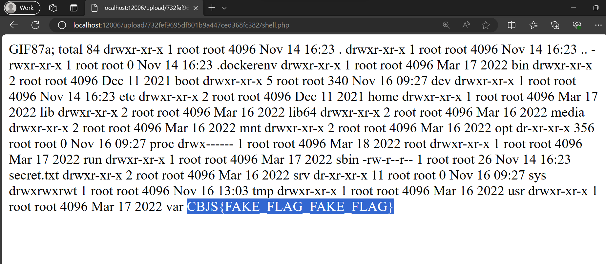

Flag : CBJS{FAKE_FLAG_FAKE_FLAG}