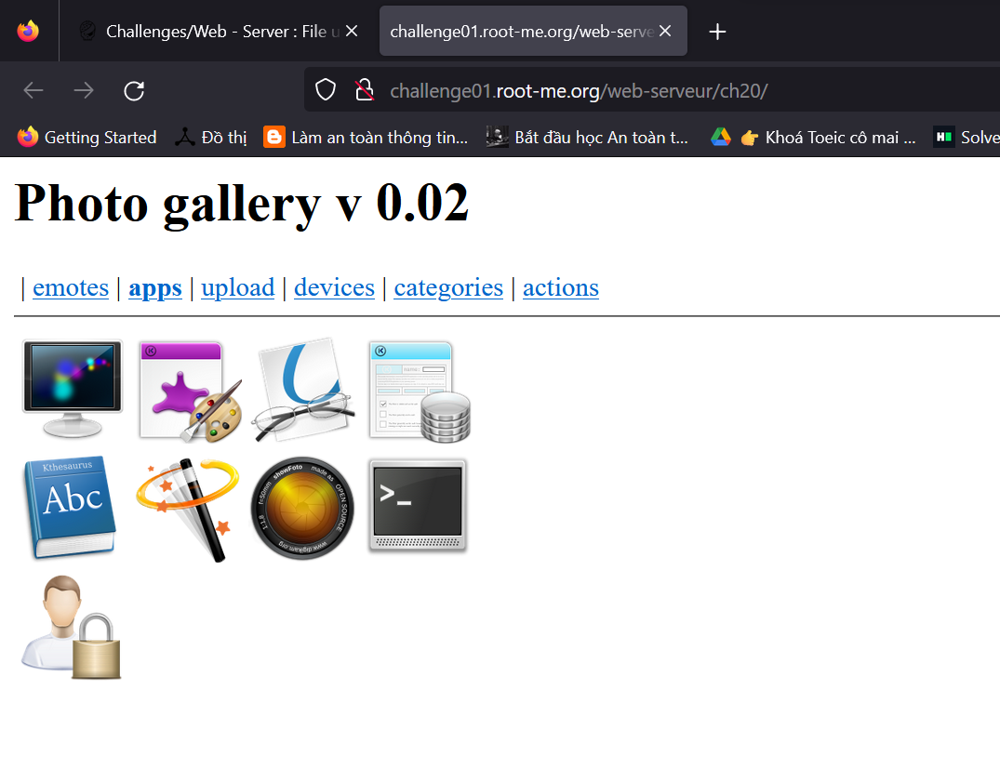
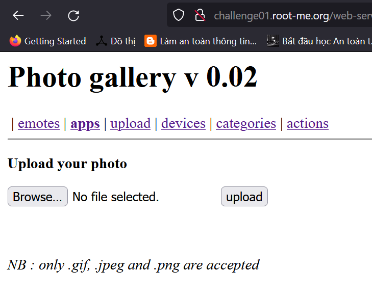
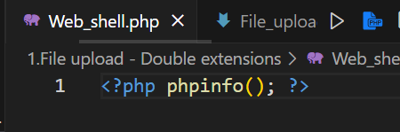
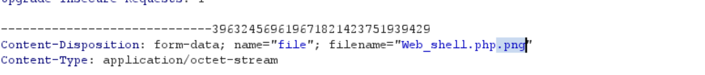
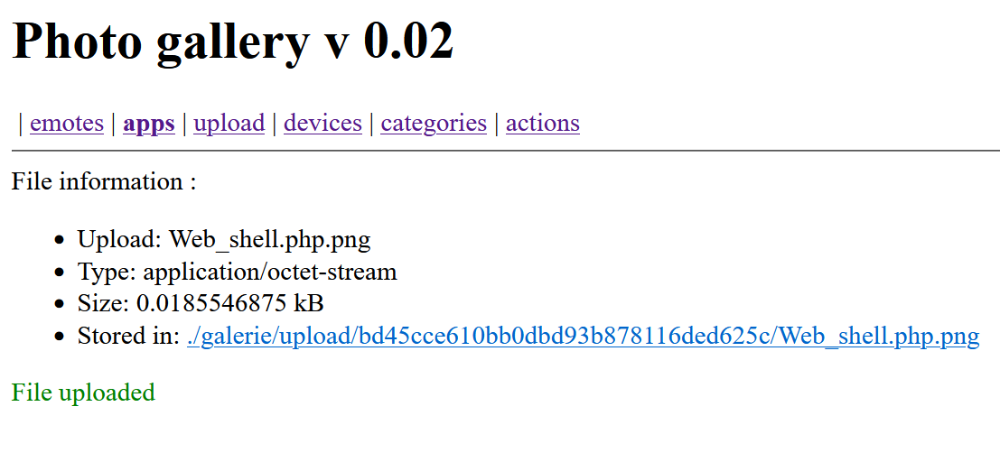
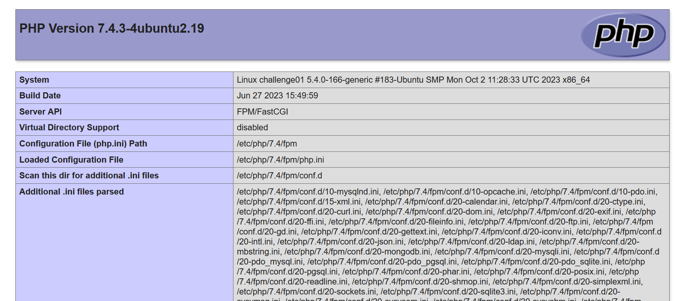
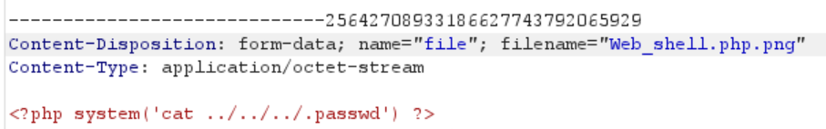

## Challenge : File upload - Double extensions 
Author : g0uZ
Statement :
- Your goal is to hack this photo galery by uploading PHP code.
- Retrieve the validation password in the file .passwd at the root of the application.

**Giải quyết :**
Đầu tiên thử thách cung cấp cho ta một trang web có giao diện như sau:

Và phần chúng ta quan tâm đó chính là chức năng upload

Trong thử thách này thì chỉ có các extensions .gif, .jpeg and .png mới được chấp nhận.
Nhìn vào tiêu đề của chall thì ta cũng đoán được là bài này chúng ta cần sử dụng kĩ thuật `Double extensions` . Vậy thì mình sẽ thử sử dụng một file `Web_shell.php` với lệnh `phpinfo()` để thử xem webshell có hoạt động không.

Trước khi gửi lên server thì mình sẽ dùng Burp Suit để bắt request và đổi tên thành file `Web_shel.php.png`

Ta nhận được thông báo đã upload thành công 

Thử bấm vào để thực thi webshell xem có hoạt động không. Kết quả trả về thành công :

Bởi vì file `.passwd` không nằm ở thư mục người dùng upload nên mình sẽ thử upload file với nội dung như sau để tìm flag: `<?php system('cat /../../../.passwd') ; ?>`

Sau khi thử và thành công ta lấy được flag : Gg9LRz-hWSxqqUKd77-_q-6G8 
