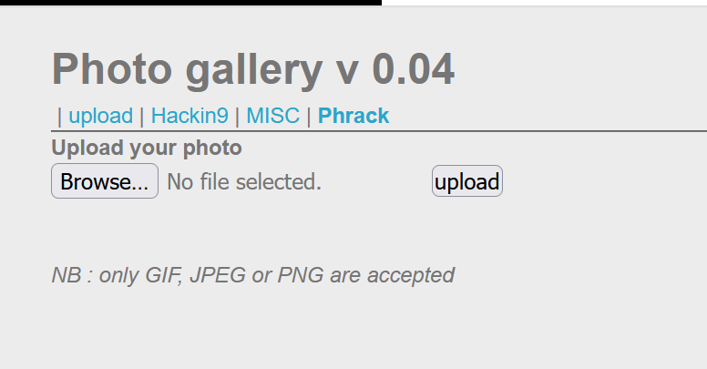
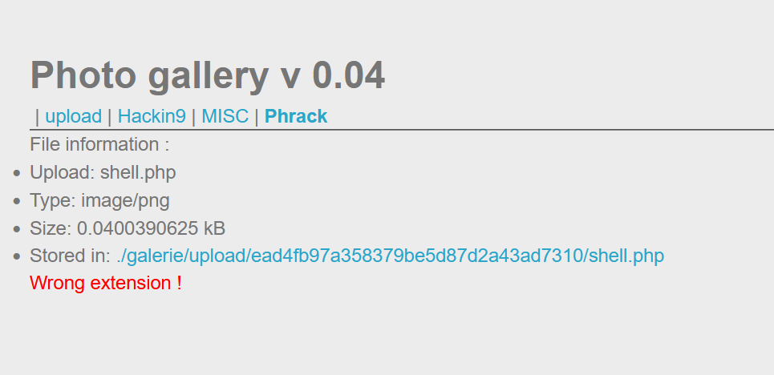
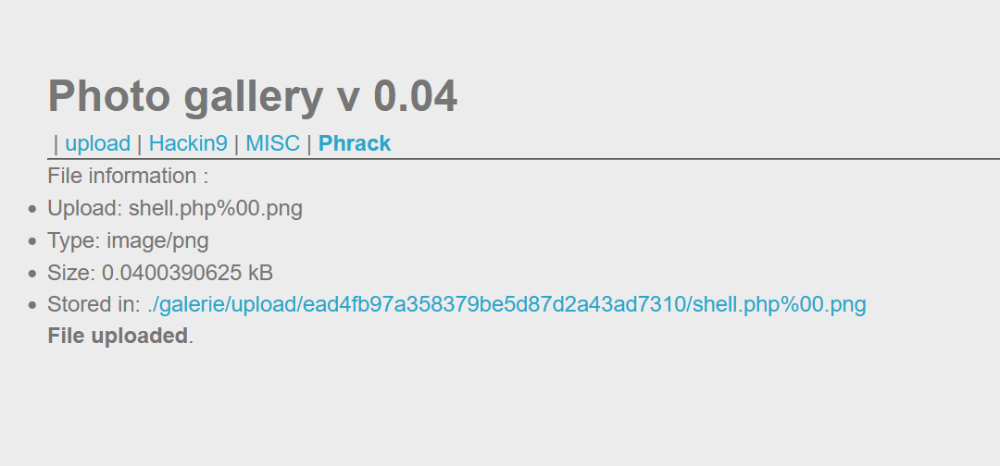
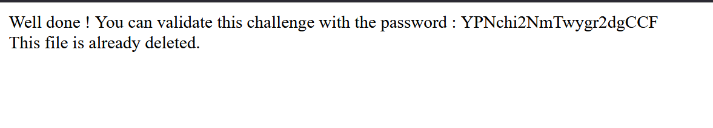

## Challenge : File upload - Null byte
Author : g0uZ
Statement
- Your goal is to hack this photo galery by uploading PHP code.

**Giải quyết :**
Đầu tiên ta được cung cấp một giao diện upload file như sau :

Từ giao diện trên đề bài cung cấp cho chúng ta rằng chỉ những type là GIF , JPEG hoặc PNG mới được chấp nhận

Vậy mình thử làm như bài `2. File upload - MIME type` , mình upload một file php có nội dung `<?php system('cat ../../../.passwd') ; ?>` . Sau đó sửa đổi `Content-Type` bằng burp suit thì trả về thông báo lỗi như sau : 

Ở bài này kiểm tra cả extensions nên ta không thể làm vậy được.

Vì đề bài đã gợi ý cho ta là sử dụng `Null byte` cho nên ta sẽ sửa tên file thành `shell.php%00.png`

**Null Byte Injection** là một kỹ thuật khai thác trong đó sử dụng các ký tự null byte URL-encoded (ví dụ: 00%, hoặc 0x00 trong hex) được người dùng cung cấp. Một null byte trong các URL được đại diện bởi ‘00%’, trong ASCII là một ” ” (giá trị null ) trong quá trình lây nhiểm . Phần sau %00 sẽ được hiểu là giá trị null , là giá trị kết thúc của chuỗi nên tệp được tải lên với tên là `shell.php`

Thử truy cập file vừa được tải lên , ta được kết quả như sau :

Flag : YPNchi2NmTwygr2dgCCF