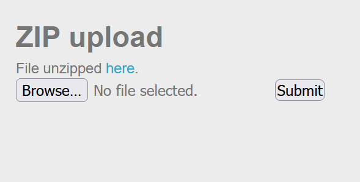
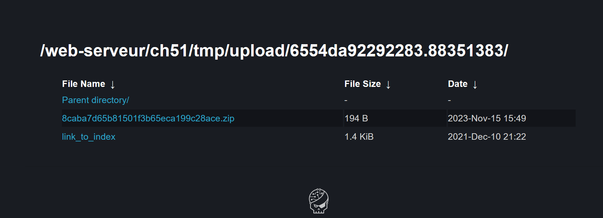
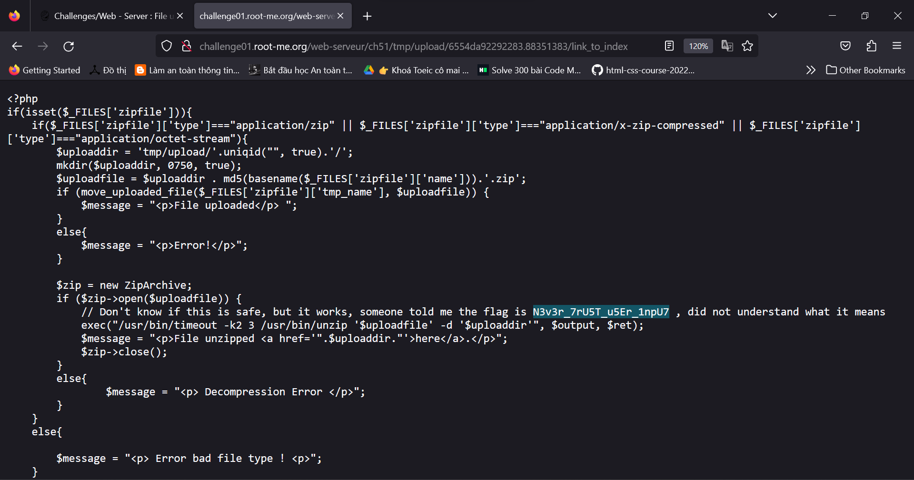

## Challenge : File upload - ZIP
Author : ghozt
Statement
- Your goal is to read index.php file.

**Nhận xét**
Bài này yêu cầu ta phải upload lên một file zip
Nhiệm vụ của ta là phải đọc được file `index.php`
Vì upload lên một file zip nên ta phải làm sao để file zip này có thể giúp ta truy cập được file `index.php`

**Giải quyết:**
1. Ta sẽ tạo một liên kết đến đến `index.php` 
- Chúng ta cần quay lại 3 folder (Thử từng folder 1 đến khi thấy index.php) và sau đó chúng ta nén lại với tùy chọn symlink (tạo liên kết tượng trưng) 

Sau khi thực hiện lệnh trên, ta sẽ có một file ZIP có tên `test.zip` chứa liên kết tượng trưng `link_to_index` trỏ tới `../../../index.php`

2. Ta upload file `test.zip` lên sever

3. Ấn vào file 

4. Chọn vào liên kết ta đã tạo trước đó và kết quả bùm!!

Flag : N3v3r_7rU5T_u5Er_1npU7