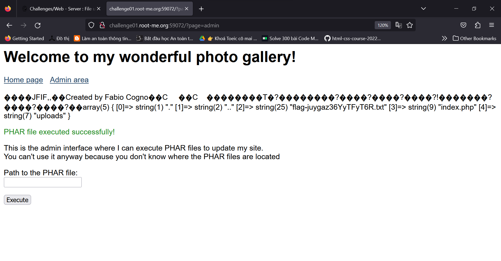

## Challenge : File upload - Polyglot
Author : Cyxo
**Statement** : Your friend who is a photography fan has created a site to allow people to share their beautiful photos. He assures you that his site is secure because he checks that the file sent is a JPEG, and that it is not a disguised PHP file. Prove him wrong!

**Tham khảo Writeup ở đây** : https://thanhlocpanda.wordpress.com/2023/08/07/php-phar-jpeg-polyglot-javascript-jpeg-polyglot-root-me-part-ii/

Đây là kết quả mình làm theo từ bài trên up trên. 
HIỆN TẠI VẪN CHƯA ĐỦ KIẾN THỨC ĐỂ HIỂU VÀ GIẢI BÀI NÀY